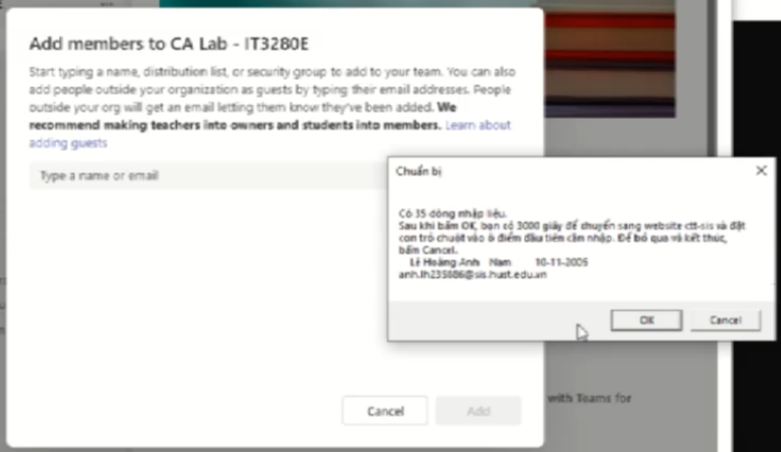
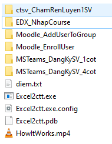

# CHƯƠNG TRÌNH ĐIỀN SỐ LIỆU VÀO FORM 

Thư mục chương trình: [**Excel2ctt\bin\Debug**\](https://github.com/neittien0110/Excel2ctt)
Chương trình có thể chạy ngay, không cần cài đặt

Xem thêm video hoạt động\

## HƯỚNG DẪN SỬ DỤNG

0. Lựa chọn template sẵn có phù hợp, kèm theo ảnh hướng dẫn trong mỗi thư mục. Copy tất cả các file trong đó, và ghi đè vào các file hiện có trong thư mục chứa file **Excel2ctt.exe**.\
   \

1. Trích xuất danh sách cần nhập liệu. Ví dụ từ qldt.hust.edu.vn.
2. Đưa thông tin của SV vào file **diem.txt** (có sẵn ở bước trước đó) theo qui tắc:
   - Thông tin của của mỗi SV nằm trên một dòng.
   - Các trường thông tin của SV cách nhau bởi kí tự **TAB**.
3. Trên trình duyệt hoặc ứng dụng cần nhập liệu như MSTeams, mở tới form cần nhập liệu, _ví dụ giao diện thêm sinh viên vào lớp học_ \
   
4. Bấm vào**Excel2ctt.exe**. Phần mềm sẽ hiện ra thông tin về dòng dầu tiên. Kiểm tra kĩ xem có bị nhầm nội dung không. Bấm **OK**.\
   ]
5. Focus (Quay trở lại)  trình duyệt hoặc ứng dụng cần nhập liệu như MSTeams ngay, bảo đảm rằng dấu nhắc promt vẫn ở ô nhập liệu đầu tiên.\
   Đợi vài giây là xong. Chương trình sẽ bắt đầu điền số liệu

## HƯỚNG DẪN NÂNG CAO

Phần mềm cho phép tinh chỉnh một số cấu hình chạy. Các cấu hình này được lưu và chỉnh sửa trong file **Excel2ctt.exe.config** ở cùng thư mục chạy. Cụ thể là:

|Tham số|Ý nghĩa|
|--|--|
|**SEPERATOR**| Kí tự dùng để phân tách giữa các trường thông tin trong file dữ liệu đầu vào, ví dụ file _diem.txt_.   Thường là kí tự ***{TAB}**, hoặc là **;**, hoặc là **,**.|
|**INPUTFORMAT**| Đặt mã cho trình tự các trường thông tin trong file dữ liệu đầu vào, theo thứ tự từ trái qua phải. Trường này chỉ chấp nhận các từ khóa sau để bóc tách dữ liệu đầu vào  **diem;mssv;stt;ten;email;ngaysinh;field1;field2;field3**   Xem thêm kí tự phân tách **SEPRATOR**|
|**GOTONEXTRECORD**| Các kí tự được gửi đi sau khi kết thúc một dòng nhập liệu, để chuyển sang dòng kế tiếp.   Mặc định là **{TAB}{TAB}**.|
|**WAITFORSWITCHINGAPP**| Thời gian đợi ban đầu, giúp người dùng có thời gian để chuyển sang ứng dụng nạn nhân để focus vào ô nhập liệu đầu tiên.   Đơn vị giây.   Mặc định 5 giây.|
|**WAITFORNEXTRECORD**| Thời gian đợi giữa 2 lần nhập số liệu của 2 bản ghi liên tiếp.   Đơn vị giây.   Với MS Teams, việc  thêm tài khoản đòi hỏi phải đợi vài giây để MS Teams kiểm tra sự tồn tại của tài khoản đó, nên phải đợi 3~5 giây.|
|**OUTPUTFORMAT**| Xác định trường thông tin nào sẽ dùng để nhập liệu.   Tên các trường này phải trùng với tên trường khai báo ở **INPUTFORMAT**   Không nhất thiết là toàn bộ thông tin ở **INPUTFORMAT** |
|**AUTOACTIVATE**| Điền 1 phần tên hiện ra trên thanh Title của ứng dụng nạn nhân, để phần mềm tự động focus vào ứng dụng đó khi người dùng bắt đầu kích hoạt quá trình nhập liệu tự động.   Bỏ qua nếu để trống |

## MÃ NGUỒN

Mã nguồn mở tại : https://github.com/neittien0110/Excel2ctt
Mục đích công bố mã nguồn mở để bảo đảm tính trung thực của
chương trình, không có bất cứ tác động nào làm thay đổi giá
trị đầu vào.
